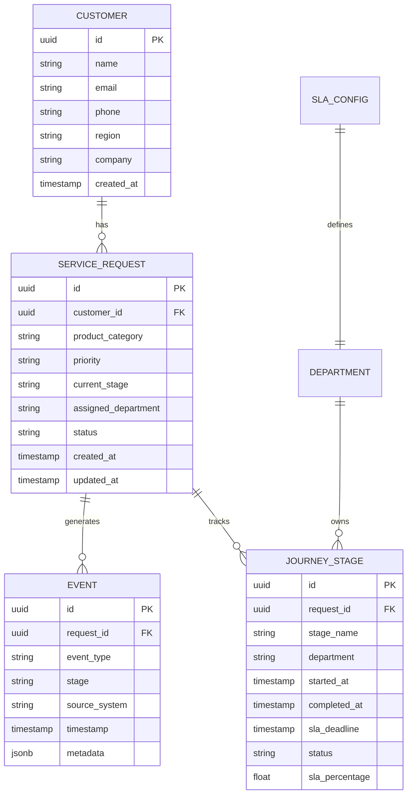

# **DAYLIFF 1000 EYES: IMPLEMENTATION PLAN**

**Objective:** Build a full-stack MVP of the Dayliff 1000 Eyes operational intelligence platform for hackathon demo.


---

## **PHASE 1: Project Scaffolding & Infrastructure**

> Set up the monorepo structure, Docker Compose, and development environment.

### Deliverables
| # | Task | Files |
|---|---|---|
| 1.1 | Create `docker-compose.yml` with 4 services: `backend`, `frontend`, `redis`, `celery-worker` | `docker-compose.yml` |
| 1.2 | Create `.env` with all environment variables (DB connection, Gemini API key, Redis URL) | `.env`, `.env.example` |
| 1.3 | Initialize FastAPI backend with Dockerfile | `backend/Dockerfile`, `backend/requirements.txt`, `backend/app/main.py` |
| 1.4 | Initialize Next.js frontend with Dockerfile | `frontend/Dockerfile`, `frontend/package.json`, `frontend/next.config.js` |
| 1.5 | Create FastAPI config module (reads from `.env`) | `backend/app/config.py` |
| 1.6 | Create SQLAlchemy database engine and session management | `backend/app/database.py` |

### Key Decisions
- Backend runs on port **8000**, frontend on port **3000**, Redis on **6379**
- Azure PostgreSQL is external (not containerized)
- All services share a `.env` file via Docker Compose `env_file`

---

## **PHASE 2: Database Schema & Domain Models**

> Define the core data model and create the PostgreSQL schema.

### Deliverables
| # | Task | Files |
|---|---|---|
| 2.1 | Create `Customer` model (id, name, email, phone, region, company) | `backend/app/models/customer.py` |
| 2.2 | Create `ServiceRequest` model (id, customer_id, product_category, priority, current_stage, assigned_dept, created_at, updated_at) | `backend/app/models/service_request.py` |
| 2.3 | Create `Event` model (id, request_id, event_type, stage, source_system, timestamp, metadata_json) | `backend/app/models/event.py` |
| 2.4 | Create `JourneyStage` model (id, request_id, stage_name, department, started_at, completed_at, sla_deadline, status) | `backend/app/models/journey_stage.py` |
| 2.5 | Create `Department` and `SLAConfig` models | `backend/app/models/department.py`, `backend/app/models/sla_config.py` |
| 2.6 | Create Alembic migration infrastructure and initial migration | `backend/alembic/`, `backend/alembic.ini` |
| 2.7 | Create Pydantic schemas for all models | `backend/app/schemas/` |

### Database Schema (ERD)


---

## **PHASE 3: Backend Core — APIs, SLA Engine & Journey Logic**

> Build the business logic layer and REST API endpoints.

### Deliverables
| # | Task | Files |
|---|---|---|
| 3.1 | Build **SLA Engine** — calculates business-hours-aware deadlines, computes SLA % consumed, determines status (on-track / warning / breached) | `backend/app/services/sla_engine.py` |
| 3.2 | Build **Journey Reconstruction** — assembles timeline from events, computes per-stage durations | `backend/app/services/journey.py` |
| 3.3 | Build **Identity Resolver** — maps cross-system IDs (CRM → ERP correlation) | `backend/app/services/identity_resolver.py` |
| 3.4 | REST API: `/api/requests` — list all requests (filterable by status, dept, region, priority) | `backend/app/api/requests.py` |
| 3.5 | REST API: `/api/requests/{id}` — single request detail with full journey timeline | `backend/app/api/requests.py` |
| 3.6 | REST API: `/api/events` — event ingestion endpoint + event listing | `backend/app/api/events.py` |
| 3.7 | REST API: `/api/analytics` — aggregated KPIs, department metrics, trend data | `backend/app/api/analytics.py` |
| 3.8 | REST API: `/api/analytics/heatmap` — department performance heatmap data | `backend/app/api/analytics.py` |
| 3.9 | Celery task: **SLA Monitor** — periodic scan for SLA threshold crossings | `backend/app/tasks/sla_monitor.py` |

### SLA Engine Logic
```
Business Hours: Mon–Fri, 08:00–17:00 EAT (9 hrs/day)

For a "4 business hours" SLA:
  - Request arrives Mon 15:00 → SLA deadline = Tue 10:00 (2h Mon + 2h Tue)
  - Request arrives Fri 16:00 → SLA deadline = Mon 11:00 (1h Fri + 3h Mon)

SLA % = (business_hours_elapsed / total_sla_business_hours) × 100
  - < 75%  → Green (On-Track)
  - 75-99% → Amber (Warning)
  - ≥ 100% → Red (Breached)
  - ≥ 150% → Deep Red (Critical)
```

---

## **PHASE 4: Synthetic Data Seeder**

> Generate ~200 realistic Dayliff service requests with full journey event histories.

### Deliverables
| # | Task | Files |
|---|---|---|
| 4.1 | Build data generation script with realistic Dayliff products, Kenyan regions, customer names | `backend/app/seed/generate.py` |
| 4.2 | Generate customers across 8 Kenyan regions | Part of `generate.py` |
| 4.3 | Generate ~200 service requests with varying priorities and product categories | Part of `generate.py` |
| 4.4 | Generate full event histories per request (4-10 events per journey) | Part of `generate.py` |
| 4.5 | Create realistic data mix: 60% completed, 25% in-progress, 10% delayed, 5% critical | Part of `generate.py` |
| 4.6 | Create CLI command to seed the database | `backend/app/seed/cli.py` |

### Data Generation Rules
- **Time span:** Past 6 months (Dec 2025 – Jun 2026)
- **Products:** Water Pumps, Solar Panels, Water Tanks, Irrigation Systems, Borehole Solutions
- **Regions:** Nairobi, Mombasa, Kisumu, Eldoret, Nakuru, Thika, Nyeri, Malindi
- **Departments:** Sales, Engineering, Quotations, Logistics
- **Journey stages:** Inquiry → Engineering Review → Quotation → Approval → Dispatch → Delivered

---

## **PHASE 5: Frontend Foundation — Design System & Layout**

> Set up Next.js, create the design system, and build the shell layout.

### Deliverables
| # | Task | Files |
|---|---|---|
| 5.1 | Initialize Next.js app with App Router | `frontend/src/app/layout.js`, `frontend/src/app/page.js` |
| 5.2 | Create CSS design system — variables, tokens, global styles | `frontend/src/styles/variables.css`, `frontend/src/styles/globals.css` |
| 5.3 | Build **Sidebar** component — navigation with icons, active state, collapsible | `frontend/src/components/layout/Sidebar.js` |
| 5.4 | Build **Header** component — page title, role-switcher, search | `frontend/src/components/layout/Header.js` |
| 5.5 | Build **RoleSwitcher** dropdown — 4 roles, persists to localStorage | `frontend/src/components/layout/RoleSwitcher.js` |
| 5.6 | Build **KPICard** component — animated number, sparkline, trend indicator | `frontend/src/components/charts/KPICard.js` |
| 5.7 | Create API hook — fetch wrapper with loading/error states | `frontend/src/hooks/useAPI.js` |
| 5.8 | Create WebSocket hook — connection, auto-reconnect, REST fallback | `frontend/src/hooks/useWebSocket.js` |

### Design System Colors (Dayliff Brand)
```css
:root {
  --color-primary: #0054A6;       /* Dayliff Blue */
  --color-accent: #F58220;        /* Dayliff Orange */
  --color-bg: #0A0F1A;            /* Deep navy-black */
  --color-surface: #111827;       /* Card backgrounds */
  --color-surface-hover: #1F2937; /* Card hover */
  --color-text: #F9FAFB;          /* Primary text */
  --color-text-muted: #9CA3AF;    /* Secondary text */
  --color-success: #10B981;       /* Green — on-track */
  --color-warning: #F59E0B;       /* Amber — SLA warning */
  --color-danger: #EF4444;        /* Red — SLA breach */
  --font-family: 'Inter', sans-serif;
}
```

---

## **PHASE 6: Dashboard Views**

> Build all 5 dashboard views with real data from the backend APIs.

### Deliverables
| # | Task | Files |
|---|---|---|
| 6.1 | **Executive Dashboard** — KPI cards row, SLA compliance gauge, department heatmap, bottleneck chart, trend lines | `frontend/src/app/page.js` |
| 6.2 | **Operations Dashboard** — live request table (sortable, filterable), SLA countdown badges, journey progress bars | `frontend/src/app/operations/page.js` |
| 6.3 | **Analytics Dashboard** — historical trend Recharts, department comparison radar, processing time by stage, regional breakdown | `frontend/src/app/analytics/page.js` |
| 6.4 | **Request Detail View** — horizontal swimlane timeline, event log, metadata sidebar, SLA status | `frontend/src/app/request/[id]/page.js` |
| 6.5 | **Swimlane Timeline** component — departments as horizontal lanes, events as color-coded nodes, connecting lines | `frontend/src/components/timeline/SwimlanTimeline.js` |
| 6.6 | **SLA Gauge** component — circular progress with color transitions | `frontend/src/components/charts/SLAGauge.js` |
| 6.7 | **Department Heatmap** component — grid with color intensity by performance | `frontend/src/components/charts/DeptHeatmap.js` |
| 6.8 | **Request Table** component — sortable columns, SLA status badges, clickable rows | `frontend/src/components/tables/RequestTable.js` |

---

## **PHASE 7: Advanced Features — Real-Time & AI Copilot**

> Wire up WebSocket real-time updates and the Gemini-powered AI Copilot.

### Deliverables
| # | Task | Files |
|---|---|---|
| 7.1 | **WebSocket Manager** — FastAPI WebSocket endpoint with Redis Pub/Sub broadcast | `backend/app/websocket/manager.py` |
| 7.2 | **WebSocket Integration** — frontend hooks consume live updates, update dashboard state | `frontend/src/hooks/useWebSocket.js` |
| 7.3 | **AI Copilot Backend** — Gemini API integration, prompt engineering for Text-to-SQL, RLS enforcement | `backend/app/services/ai_copilot.py`, `backend/app/api/copilot.py` |
| 7.4 | **AI Copilot Frontend** — query input, response display (tables/charts), query history | `frontend/src/app/copilot/page.js`, `frontend/src/components/copilot/QueryInterface.js` |
| 7.5 | **Final Polish** — loading skeletons, error states, micro-animations, responsive breakpoints | All component files |
| 7.6 | **Docker final test** — `docker-compose up --build` runs everything clean | `docker-compose.yml` |

---

## **BUILD ORDER SUMMARY**

```mermaid
gantt
    title Dayliff 1000 Eyes — Build Order
    dateFormat X
    axisFormat %s

    section Infrastructure
    Phase 1 - Scaffolding          :p1, 0, 1
    
    section Data Layer
    Phase 2 - Database Schema      :p2, after p1, 1
    Phase 4 - Synthetic Data Seed  :p4, after p2, 1
    
    section Backend
    Phase 3 - APIs & SLA Engine    :p3, after p2, 2
    
    section Frontend
    Phase 5 - Design System & Layout :p5, after p1, 1
    Phase 6 - Dashboard Views      :p6, after p3, 2
    
    section Advanced
    Phase 7 - Real-Time & AI       :p7, after p6, 2
```



> [!TIP]
> **Phases 3 and 5 can run in parallel** — backend API development and frontend design system creation are independent until Phase 6 connects them.

---

## **DEFINITION OF DONE**

A single `docker-compose up --build` command spins up:
1. ✅ FastAPI backend serving REST APIs on `:8000`
2. ✅ Next.js frontend with 5 dashboard views on `:3000`
3. ✅ Redis powering WebSocket real-time updates
4. ✅ Celery worker monitoring SLA thresholds
5. ✅ ~200 synthetic requests with full journey data in Azure PostgreSQL
6. ✅ AI Copilot answering natural language queries via Google Gemini
7. ✅ Role-switcher demonstrating RBAC without authentication
8. ✅ Dayliff brand identity with premium dark-mode UI

---

*Ready to build. Proceed to start Phase 1.*
